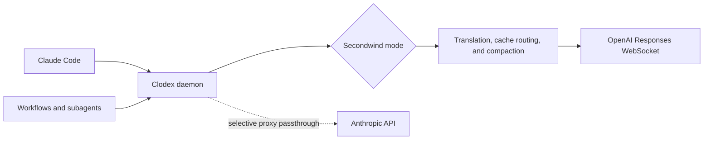
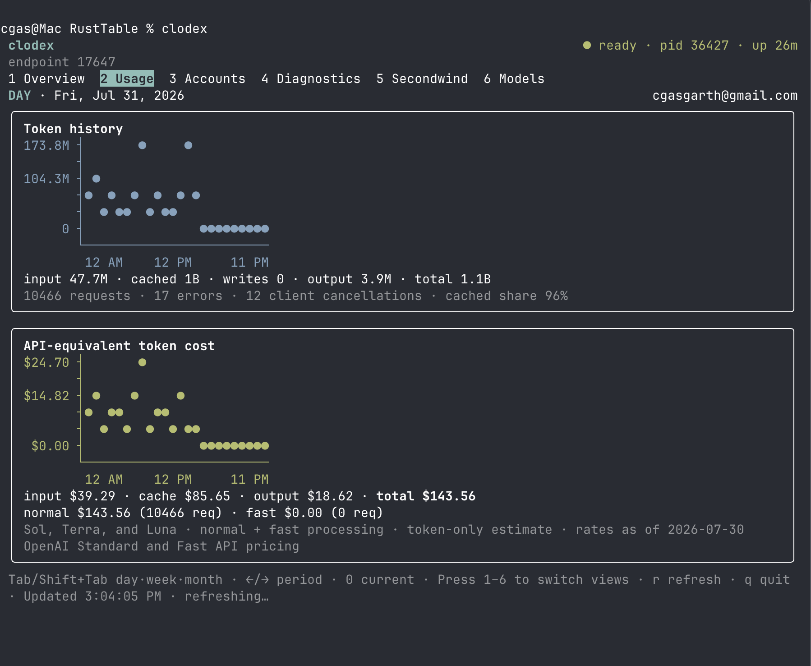
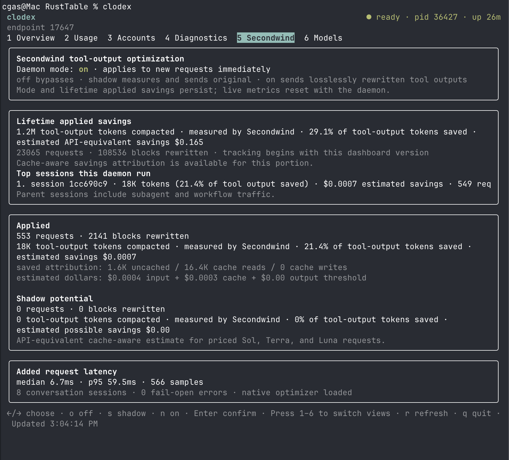

# Run Codex models in Claude Code with clodex

[](https://www.npmjs.com/package/@bman654/clodex)

**clodex** lets you use OpenAI Codex models inside Claude Code with either a
ChatGPT/Codex subscription or an OpenAI API key. Pick Sol, Terra, Luna, or other
enabled OpenAI models from Claude's `/model` menu and keep the Claude Code
experience around them:

- main sessions, resumable sessions, subagents, workflows, and agent teams;
- Claude Code's terminal UI, system prompt, tools, skills, hooks, and MCPs;
- model aliases such as `sol`, `terra`, and `luna` in prompts and agent
  frontmatter; and
- long-running context with prompt caching and optional native Codex
  compaction.

One local daemon handles translation, OpenAI WebSocket continuation, caching,
compaction, accounts, metrics, and diagnostics for every Claude session and its
children. Anthropic models can still use Claude Code's normal Anthropic login.


> clodex is derived from the original [relay-ai](https://github.com/jacob-bd/relay-ai) project, heavily modified and streamlined for this one use case, with the full commit history preserved.

Contributions are welcome — see [CONTRIBUTING.md](./CONTRIBUTING.md) for how to scope a PR and what the quality bar is.

When installing a local checkout, use `bun run install:global`. It replaces an
older global tarball cleanly, retains one stable package archive, and verifies
that every runtime artifact matches the checkout.

## Quick start

Install clodex, sign in to OpenAI, choose the Codex models you want Claude to
show, and patch Claude Code's model metadata:

```bash
bun add --global @bman654/clodex
clodex providers auth openai
clodex models
clodex models --alias sol=clodex:openai-oauth:gpt-5.6-sol
clodex models --alias luna=clodex:openai-oauth:gpt-5.6-luna
clodex models --alias terra=clodex:openai-oauth:gpt-5.6-terra
clodex patch
clodex claude
```

After setup, use `clodex claude` wherever you would normally use `claude`.
Inside Claude Code, `/model` switches between your enabled Codex models. Bare
`clodex` opens the daemon dashboard; `clodex start` starts it without opening
the dashboard.

OAuth credentials are stored in the OS credential store. API-key users can use
`clodex providers add` instead. Favorites and aliases feed `/model`, routing,
subagent model selection, and patching. Re-run `clodex patch` after Claude Code
updates, or restore the pristine Claude binary with `clodex patch --restore`.

## What you get inside Claude Code

| Claude Code capability | With Codex models through clodex |
| --- | --- |
| Main sessions, subagents, workflows, and agent teams | Yes |
| Claude Code system prompt, skills, tools, and model frontmatter | Yes |
| Anthropic and OpenAI models in the same Claude installation | Yes |
| Correct per-model context windows in patched Claude Code | Yes |
| Persistent shared daemon and OpenAI WebSocket continuation | Yes |
| Stable prompt-cache routing and explicit cache breakpoints | Yes |
| Native OpenAI/Codex compaction with durable recovery | Optional |
| In-process Secondwind tool-output optimization | Built in; defaults on |
| Multiple manually selected ChatGPT/Codex accounts | Up to five |

Clodex can also expose local Anthropic- and OpenAI-compatible endpoints, but
the primary path is `clodex claude`: Claude Code remains the client and clodex
routes only the selected OpenAI models.

### Claude Code Plans and ToS

Clodex does not duplicate Claude Code's OAuth flow. In selective proxy mode,
Anthropic requests pass through to `api.anthropic.com` with Claude Code's own
credentials unchanged; only configured OpenAI models are rerouted.

## How it works

`clodex claude` routes every main session and Claude-spawned child through one
restart-stable daemon endpoint. Signed launch tickets keep workflows and
subagents pinned to their parent's account.



Standalone `clodex server` supports:

- **`--proxy`** — selectively reroutes saved OpenAI models while Anthropic
  requests retain Claude Code's own login.
- **`--endpoint`** — exposes local Anthropic- and OpenAI-format gateways plus a
  `/v1/models` catalog.

See [background agents](docs/background-agents.md) for wrapper and service
details.

## Efficiency and context lifecycle

### Prompt caching

Clodex keeps cacheable prefixes stable across main sessions, workflows, and
subagent waves:

- stable session-derived `prompt_cache_key` routing;
- OpenAI cache breakpoints and 30-minute cache options on supported API-key
  models;
- removal of changing Anthropic billing metadata from OpenAI OAuth prompts;
- persistent WebSocket `previous_response_id` continuation, isolated by
  account, model, effort, session, and agent lineage; and
- unchanged request bytes when Secondwind has nothing to rewrite.

The dashboard reports uncached input, cache reads, cache writes, output, cache
share, and API-equivalent cost.

### Native OpenAI/Codex compaction

Optional native compaction keeps long model-facing chains inside OpenAI instead
of asking a model to summarize the full Claude transcript. Clodex first uses a
cache-warm in-band `compaction_trigger`; when no live response head is
available, it falls back to `POST /responses/compact`. Manual `/compact` stores
the opaque result behind a synthetic Claude checkpoint, and durable checkpoints
allow matching parent, subagent, and workflow histories to recover after daemon
restart.

Native compaction is off by default because OpenAI's compacted chain and
Claude's saved transcript are different state. Enable and tune it with
`CLODEX_OPENAI_COMPACTION=1` and `CLODEX_OPENAI_COMPACT_THRESHOLD`; read the
[native compaction guide](docs/native-codex-compaction.md) before doing so.

### Secondwind

[Secondwind](https://github.com/orchetron/secondwind) is optional, in-process
tool-output optimization:

- `off` bypasses it;
- `shadow` measures a lossless rewrite while sending the original request; and
- `on` sends rewritten tool outputs, with fail-open fallback.

Stateless rewrites are randomly distributed across a machine-sized Bun child-process
pool. Workers recycle after bounded request or byte budgets so native allocator
high-water memory returns to the OS without serializing concurrent agents.

The selected daemon-wide mode persists and applies to the next request.
Secondwind reports measured tokens and input percentage saved, cache-aware
API-equivalent savings, lifetime totals, top parent sessions, and median/p95
latency.

An initial Luna/medium codec-stress screen used three fresh sessions per
condition. All hidden graders passed, while median total input fell in each
case:

| Benchmark | Correct off / on | Median input off | Median input on | Change |
| --- | ---: | ---: | ---: | ---: |
| Null, empty, and absent values | 3/3 · 3/3 | 139K | 118K | −15.2% |
| Parent-child dependency join | 3/3 · 3/3 | 163K | 118K | −27.5% |
| Grouped path restoration | 3/3 · 3/3 | 126K | 119K | −5.3% |

Across optimized requests, Secondwind rewrote 42 blocks and removed 23,992 of
53,178 measured tool-output tokens (45.1%). See the
[benchmark report](benchmarks/secondwind/results/luna-medium-2026-07-30/README.md)
for the method, latency, and raw results.

## Persistent daemon and dashboard

The daemon owns the shared endpoint, WebSocket pools, compaction checkpoints,
accounts, metrics, and diagnostics:

```bash
clodex daemon install       # macOS LaunchAgent; starts at login
clodex start                # start only; no dashboard
clodex-claude               # launch a bridged Claude session
clodex                      # start if needed, then open the Ink dashboard
clodex stop                 # stop the daemon
```

Bare `clodex` starts the daemon if needed and opens six views: Overview, Usage,
Accounts, Diagnostics, Secondwind, and Models. Press `1`–`6` to switch views. Usage
supports day/last-7-days/last-30-days navigation with `Tab`, `Shift+Tab`, `←`, `→`, and `0`.
Secondwind mode changes require confirmation. The Models view enables or disables OpenAI
models in the live route catalog and the patched picker used by new Claude launches.
The Diagnostics view switches between compact error-only logs and full lifecycle logs;
full mode records native compaction start, completion, duration, and recovery details.

### Usage, caching, and API-equivalent cost

The Usage view shows account-scoped input, cache reads, cache writes, output,
request failures, cache share, and what the same traffic would cost at the
published OpenAI API rates. ChatGPT subscription usage is not billed by these
figures.



### Secondwind savings and latency

The Secondwind view reports measured tool-output tokens removed, percent saved,
cache-aware estimated savings, top sessions, and median/p95 latency added by the
optimizer.



Metrics are retained for 400 days in owner-only SQLite. They aggregate in memory
and flush as one compact batch row each minute or after 1,000 records; dashboard
reads do not force disk writes, and shutdown flushes immediately. Cost figures
for Sol, Terra, and Luna include Standard/Fast, cache, and long-context pricing.
They are API-equivalent estimates, not ChatGPT subscription charges.

Up to five ChatGPT/Codex logins can be stored:

```bash
clodex accounts add
clodex accounts list
clodex accounts select person@example.com
clodex accounts usage
```

Accounts are identified by OpenAI sign-in email. Selection is manual and affects
new launches only; existing sessions and their children remain pinned. Clodex
does not fail over after quota, capacity, or authentication errors.

## CLI reference

### `clodex claude [options] [claude-flags]`

Launch Claude Code bridged to OpenAI models. Unrecognized flags (and everything after `--`) pass through to Claude Code (`-c`, `--resume`, `--print`, …).

| Flag | Effect |
| --- | --- |
| `--endpoint` | Accepted for compatibility; Claude always uses the daemon endpoint |
| `--save-mode` | Accepted with `--endpoint` for compatibility |
| `--dry-run` | Run the wizard but print a launch preview instead of launching (never persists anything) |
| `--trace` | Write debug logs to `~/.clodex/logs/` and show errors on exit |
| `--provider <id>` | Boot provider id (`openai` or `openai-oauth`); with `--model`, skips the wizard |
| `--model <id>` | Boot model id; with `--provider`, skips the wizard |
| `--help`, `--version` | Help / version |

Notes:

- `--proxy` belongs to standalone `clodex server` and is rejected by
  `clodex claude`.
- Claude Code may save the launched model to `~/.claude/settings.json`, so bare
  `claude` later can still show a clodex model name.
- Non-interactive stdin reuses your last provider/model instead of showing the
  wizard.

### `clodex server [options]`

Foreground gateway, same two bridge modes, no Claude Code launch — point any Anthropic-format (or OpenAI-format) client at it.

Common options (both modes):

| Flag | Effect |
| --- | --- |
| `--endpoint` | Endpoint mode for this run: Anthropic-format HTTP gateway |
| `--proxy` | Proxy mode for this run: selective `api.anthropic.com` MITM proxy (default when nothing is saved; local only) |
| `--save-mode` | With `--endpoint`/`--proxy`: save that mode as the `server` default |
| `--port <1-65535>` | Listen port (default 17645) |
| `--no-discovery` | Don't advertise this server in `~/.clodex/server-runtime.json` (`CLODEX_NO_DISCOVERY=1` also works). Use it for a standalone endpoint the `clodex-claude` wrapper should ignore. |
| `--ws-diagnostics` | Log sanitized request envelopes and WebSocket head decisions |
| `--help`, `--version` | Help / version |

Endpoint mode only (an error if combined with `--proxy`):

| Flag | Effect |
| --- | --- |
| `--quick`, `--saved` | Start immediately from saved/default settings, skipping the wizard |
| `--listen local\|network` | One-run listen mode override |
| `--providers all\|favorites\|id1,id2` | One-run provider catalog override |
| `--mask-gateway-ids` / `--no-mask-gateway-ids` | Mask or expose vendor names in discovery model ids (see below) |
| `--password <value>` | One-run network-mode server password |

Bare `clodex server` uses the saved mode, defaulting to proxy. Endpoint mode
opens its wizard only on a TTY; `--quick` and non-interactive launches use saved
settings. Network endpoint mode requires a saved password or `--password`.

Endpoint discovery masks vendor strings by default for Claude clients that
reject non-Anthropic model ids. Requests may still use the masked id, canonical
`clodex:<provider>:<model>` id, or a saved alias. Use
`--no-mask-gateway-ids` when readable discovery ids are preferred.

Endpoint-mode endpoints (default port 17645):

```
ANTHROPIC_BASE_URL=http://127.0.0.1:17645/anthropic
OPENAI_BASE_URL=http://127.0.0.1:17645/openai/v1
```

Local endpoint mode accepts any API key; network mode requires its password.
Proxy mode prints the proxy and CA environment to export—do not set
`ANTHROPIC_BASE_URL` there. Multiple standalone servers may coexist through
`~/.clodex/server-runtime.json`; `--no-discovery` keeps one private.

Examples:

```bash
# Endpoint gateway serving only your favorites, no prompts, for a local client
clodex server --endpoint --quick --providers favorites

# Proxy mode for an existing-auth Claude Code (export the env it prints)
clodex server --proxy
```

### `clodex patch [--restore]`

Patch the installed Claude Code binary so clodex favorites and aliases are first-class: accepted by the Agent tool's model field, listed in `/model`, resolved to their real ids, and reporting the correct context window.

| Flag | Effect |
| --- | --- |
| `--restore` | Restore the pristine (unpatched) Claude Code binary |
| `--trace` | Show the underlying tweakcc output |
| `--help` | Help |

The patch map is built from your favorites and aliases; context windows come from provider metadata. A pristine per-version backup is kept, and a manifest (`~/.clodex/patch-state.json`) makes re-runs no-ops until your config or Claude Code version changes — then the binary is restored first and re-patched fresh. `clodex claude` checks patch freshness at launch and offers to re-patch (a non-blocking notice when not interactive). Re-run `clodex patch` after every `claude` update.

Claude Workflow normally stops an agent after 180 seconds without a semantic
content event. Patched installations accept
`CLODEX_WORKFLOW_STALL_TIMEOUT_MS` to increase that watchdog for models that
spend longer generating buffered tool input. The default remains 180 seconds;
overrides are clamped to 3–30 minutes.

### `clodex models` / `clodex favorites`

Manage favorite models (max 20) and short aliases. Favorites feed the endpoint-mode `/model` switch menu, proxy-mode routing, and the patcher. Saved to `~/.clodex/config.json`.

| Flag | Effect |
| --- | --- |
| *(none)* | Interactive manager: search all providers or browse one at a time |
| `--list` | Print the exact `clodex:<provider-id>:<model-id>` names (and aliases) without opening the manager |
| `--alias <name=target>` | Save a short name for a favorite, e.g. `--alias sol=clodex:openai-oauth:gpt-5.6-sol` (the `clodex:` prefix is optional in the target) |
| `--unalias <name>` | Remove a saved short name |
| `--help`, `--version` | Help / version |

### `clodex providers [subcommand]`

| Subcommand | Effect |
| --- | --- |
| *(none)* | Provider hub wizard |
| `add` | Add OpenAI with an API key (choose OAuth or API key) |
| `auth openai` | Sign in with ChatGPT/Codex-plan OAuth (device code) |
| `list` | Show configured providers |
| `remove <id>` | Remove a provider by id |
| `refresh-models [id]` | Update cached model lists |

Providers supported: `openai` (API key, platform.openai.com) and `openai-oauth` (ChatGPT/Codex plan).

### Root

```
clodex --help       # overview of all commands
clodex --version    # version
```

## Configuration

- Config lives under `~/.clodex`; override it with `CLODEX_HOME`. Legacy
  `~/.relay-ai` config migrates automatically without modifying the source.
- Credentials live in the OS credential store. Recovery metadata and mutation
  locks are fail-closed and serialized under the native `~/.clodex` account
  home. Use Clodex commands rather than deleting keychain entries or active lock
  files manually. Local filesystems must support hard links.
- Set `CLODEX_CREDENTIAL_HELPER` to an absolute executable to use an external
  secure store; see [credential helpers](docs/credential-helpers.md).
- Anonymous routes strip credential-bearing headers; authenticated routes
  forward configured provider headers.
- `CLODEX_CLAUDE_PATH` overrides Claude Code binary discovery.
- `HTTP_PROXY`, `HTTPS_PROXY`, and `NO_PROXY` apply to Clodex OAuth, discovery,
  OpenAI HTTP, and Responses WebSocket traffic.

## Known limitations

- Cost display inside Claude Code is inaccurate for OpenAI models (Claude Code applies its own pricing table).
- In the endpoint-mode switch menu, the displayed context window reflects the launch model and does not update on live `/model` switches (Claude Code fetches window metadata once at startup). Proxy mode with `clodex patch` reports correct per-model windows.
- ChatGPT/Codex OAuth requires `store:false` upstream; some OpenAI cache controls are intentionally omitted on OAuth routes because they returned empty responses during compatibility testing.
- An already-oversized legacy Claude transcript that never acquired a native
  compaction checkpoint may not be recoverable in place. Create a new session
  from a portable handoff instead of repeatedly replaying it.

## License

MIT — see [LICENSE](LICENSE).
