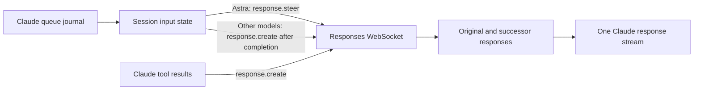

# Responses sessions, queued input, and hosted tools

Clodex uses native Responses steering for queued text input in local Astra
sessions. Other local Responses models, including Sol, receive that input in a
normal continuation before Clodex closes the turn. It keeps one delivery state
per response lineage and preserves the
provider's output separately from Claude's replay representation.

## Event delivery

The local daemon reads new `queue-operation` entries from the active main
session's transcript. It does not modify Claude's queue. Normal prompt hooks
run too late for this purpose: an isolated Claude 2.1.263 test showed the second
prompt hook running after the first request ended.

| Input | Astra | Sol and other Responses models |
| --- | --- | --- |
| User text sent during a turn | Native user steering input | User input in the next response |
| Background command completion | Automated task notification via steering | Automated task notification in the next response |
| Workflow or subagent completion | Automated task notification via steering | Automated task notification in the next response |
| Required client tool output | Normal tool result on the same connection | Normal tool result on the same connection |

The API supports native mid-turn steering only for Astra. Sol cannot receive an
update inside an active response. For models without native steering, Clodex
waits for the response to complete, sends queued input with `response.create`,
and reads the continuation before closing the Claude stream. If the response
requires a client tool, Claude runs it first. An update included with its tool
result is used there; otherwise, Clodex retains the update for the next response
boundary. This does not interrupt or undo tools already in progress.

Task notifications retain their source warning. They do not grant user
approval. A notification that points to an output file does not replace reading
that file. Non-text queue entries continue through Claude's normal request path.
The reader uses the daemon's `CLAUDE_CONFIG_DIR`, or `~/.claude` by default.
Network/API requests cannot enable local transcript access through their metadata.

Delivery is tracked as waiting, sent, accepted, committed, echoed, or failed. Acceptance
means the server has queued the input; the successor's `response.created` commits
it. The stream remains open through automatic successors. When client tools are
required, Claude runs them normally and sends their results; accepted steering
is not sent again. Later echoes in Claude's history remain in its matching
representation but are removed from the new provider input. This covers both
Claude's reminder envelopes and plain user messages from its SDK, and matches
each repeated message to one queue occurrence.
For models without native steering, `response.created` commits input sent in a
continuation. Echoes that arrive first through Claude retain normal delivery.

Before ending a response, the reader drains new journal records once more.
It checks enqueue timestamps as well as file position: Claude can flush an old
queue record after the watcher starts, and replaying that record could repeat
the initial task. New messages with identical text still retain their own events.
Socket frames received during that drain are processed in order. Failures retain
the original event for Claude's normal delivery path. Pending steering is
connection-local, so an uncommitted update must be submitted again on recovery.

See the [steering guide](https://developers.openai.com/api/docs/guides/steering)
and [event reference](https://developers.openai.com/api/reference/resources/responses/websocket-events#response.steer).

## Reasoning and replay

Claude's simplified history is used to match the next request to a lineage.
Provider replay uses the retained native items, including encrypted reasoning,
assistant phase, tool-call identity, hosted search records, and annotations.
This prevents a reconnect from reducing a commentary message to unmarked text.
Automatic successors contribute to billed usage; context-window decisions still
use the final response's measured input size.

This follows the [reasoning guide](https://developers.openai.com/api/docs/guides/reasoning?api-mode=responses).
Reasoning effort selection remains explicit. The new `configuration_update`
API is a separate compaction design change: the documented standalone compact
endpoint rejects histories containing these updates.

## Web search and computer use

When Claude exposes `WebSearch`, the OpenAI OAuth adapter offers native
`web_search`. OpenAI selects and executes searches during the response. The
existing SDK requests source metadata, and Clodex passes search results and URL
citations to Claude. Server-executed search calls are never returned as client
tool calls to execute again. Explicit Anthropic search domain filters and user
location still use the existing native mapping.

The [web search guide](https://developers.openai.com/api/docs/guides/tools-web-search)
describes this hosted tool. The
[computer-use guide](https://developers.openai.com/api/docs/guides/tools-computer-use)
recommends code execution for Astra and permits existing UI tools. Clodex keeps
Claude/MCP responsible for UI execution and permissions, including the current
image-result transport. A native `computer` tool would also require an action
executor and screenshot/approval loop; advertising it without that executor
would leave calls unanswered.
