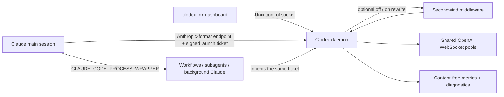

# Persistent Clodex for workflows and background agents

Use one supervised Clodex daemon for terminal sessions, Claude Code workflows,
subagents, agent teams, and background sessions. This keeps OpenAI WebSocket
continuation pools and compaction checkpoints in one process instead of
creating a proxy per Claude session.

## Architecture



- The Clodex daemon owns one Anthropic-format endpoint, OpenAI WebSocket pools,
  compaction checkpoints, session registry, metrics, diagnostics, and optional
  conversation-affine Secondwind worker sessions.
- The endpoint listens on restart-stable loopback port `17647`. Set
  `CLODEX_DAEMON_PORT` before installation to change it.
- Control operations use `~/.clodex/clodex.sock`, mode `0600`.
- `clodex-claude` obtains a signed launch ticket and sends it in
  `x-clodex-launch-ticket` beside a stable local API key. Claude-spawned
  children inherit that ticket, so a workflow shares the same account-selection
  policy as its parent without generating a new custom-key approval prompt.
- Manual account selection affects the next request from new and existing
  default-account launches. The Accounts dashboard can enable usage-limit
  failover to another healthy account for the same provider. An explicit
  `--clodex-account` launch remains pinned. Auth and capacity failures do not
  switch accounts.

## Setup on macOS

```bash
clodex providers auth openai   # first ChatGPT/Codex login
clodex daemon install          # install and start the LaunchAgent
clodex daemon status
```

Start Claude Code with the real binary after the one-time settings setup in the
main README:

```bash
claude
claude --resume <session>
```

Set Claude Code's process wrapper in `~/.claude/settings.json` to the absolute
`clodex-claude` path so
workflows, subagents, and background sessions use the same daemon:

```json
{
  "env": {
    "CLAUDE_CODE_PROCESS_WRAPPER": "/absolute/path/to/clodex-claude"
  }
}
```

The internal wrapper must ultimately `exec` Claude. Do not use it as the
terminal startup command. Do not point it at a short-lived version-manager
shim.

## TUI and service commands

Bare `clodex` starts the daemon when needed, then opens the Ink dashboard.
`clodex start` starts it without opening the dashboard, and `clodex stop`
stops it.

- `1`–`5`: switch Overview, Usage, Accounts, Diagnostics, and Secondwind views
- Usage: `Tab` changes range; `←`/`→` changes period
- Accounts: `↑`/`↓` chooses; `Enter` selects; `l` logs in; `x x` logs out
- Secondwind: `←`/`→` or `o` and `n` choose a mode; `Enter` confirms
- `r`: refresh
- `q`: quit the dashboard; the daemon keeps running

Service commands:

```bash
clodex daemon status
clodex daemon restart
clodex daemon logs
clodex daemon stop
clodex daemon uninstall
```

On non-macOS systems, run `clodex daemon run` under the user's service manager.

## Accounts

The first existing `openai-oauth` and `xai-oauth` logins are migrated into the
account list. Additional logins use independent OS-credential-store entries:

```bash
clodex accounts add openai
clodex accounts add xai
clodex accounts list
clodex accounts select person@example.com
clodex accounts remove person@example.com
```

The dashboard and CLI identify accounts only by their provider and sign-in email.
Clodex stores only account metadata in `~/.clodex/accounts.json`; OAuth secrets
remain in the configured credential store. OpenAI and SuperGrok keep independent
defaults. A normal signed ticket resolves those selections for every request, so
an existing session switches after a manual selection. An explicit account
override stays pinned. Removing or losing a pinned credential makes that session
fail explicitly. Clodex does not select a different account after an error.

## Metrics and privacy

`~/.clodex/daemon-metrics.sqlite` contains timestamps, model/provider ids,
hashed session ids, token counts, latency, and completion/error/cancellation
state. It never stores prompts, tool output, response text, OAuth tokens, or
launch tickets. The database is mode `0600` and retains 400 days. The TUI
offers day, week, and month token and API-equivalent cost views.

## Troubleshooting

- `clodex daemon status`: process, endpoint, WebSocket, and active-session state.
- `clodex daemon logs`: daemon stdout/stderr and inference log paths.
- `clodex-claude --check`: exits `0` when a discovered server is reachable.
- `CLODEX_REQUIRE_SERVER=1`: fail closed instead of launching unbridged Claude.
- Port occupied: set `CLODEX_DAEMON_PORT` to a free stable port, then reinstall
  the LaunchAgent.
- Wrapper fails only for spawned agents: use absolute wrapper and Bun paths; do
  not remove the launcher's final `exec`.
