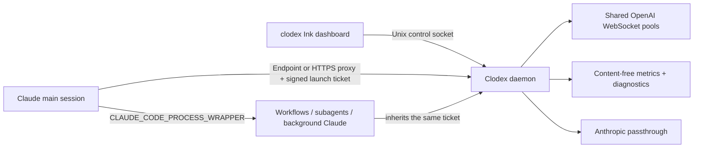

# Persistent Clodex for workflows and background agents

Use one supervised Clodex daemon for terminal sessions, Claude Code workflows,
subagents, agent teams, and background sessions. This keeps OpenAI WebSocket
continuation pools and compaction checkpoints in one process instead of
creating a proxy per Claude session.

## Architecture



- The Clodex daemon owns the Anthropic-format endpoint, selective HTTP proxy,
  OpenAI WebSocket pools, compaction checkpoints, session registry, metrics,
  and diagnostics.
- The endpoint and proxy listen on restart-stable loopback ports `17647` and
  `17646`. Set `CLODEX_DAEMON_PORT` before installation to change the proxy
  base port.
- Control operations use `~/.clodex/clodex.sock`, mode `0600`.
- `clodex-claude` obtains a signed launch ticket and embeds it as local proxy
  authentication. Claude-spawned children inherit that ticket, so a workflow
  stays on the same account as its parent.
- Account selection affects new launches only. There is no quota/auth/capacity
  failover.

## Setup on macOS

```bash
clodex providers auth openai   # first ChatGPT/Codex login
clodex daemon install          # install and start the LaunchAgent
clodex daemon status
```

Use `clodex-claude` for terminal launches:

```bash
clodex-claude
clodex-claude --resume <session>
clodex-claude --clodex-account person@example.com
```

`clodex claude …` is the higher-level equivalent: it starts the daemon when
needed, launches through the shared proxy, and automatically points
Claude-spawned children at `clodex-claude`.

Set Claude Code's process wrapper to the absolute `clodex-claude` path so
workflows, subagents, and background sessions use the same daemon:

```bash
export CLAUDE_CODE_PROCESS_WRAPPER="/absolute/path/to/clodex-claude"
```

The wrapper must ultimately `exec` Claude. If a stable shell launcher is needed
for a Node version manager, keep its final command in this form:

```sh
exec /absolute/path/to/node /absolute/path/to/clodex/dist/claude-wrapper.js "$@"
```

Do not point `CLAUDE_CODE_PROCESS_WRAPPER` at a short-lived version-manager
shim. Verify the exact path from a minimal environment before relying on
background agents.

## TUI and service commands

Bare `clodex` starts the daemon when needed, then opens the Ink dashboard.
`clodex start` starts it without opening the dashboard, and `clodex stop`
stops it.

- `↑`/`↓`: choose an account
- `Enter`: make it the default for new launches
- `r`: refresh usage windows
- `s`: restart the daemon
- `q`: quit the dashboard; the daemon keeps running

Service commands:

```bash
clodex daemon status
clodex daemon restart
clodex daemon logs
clodex daemon stop
clodex daemon uninstall
```

On non-macOS systems, run `clodex daemon run` under the user's service manager.

## Accounts

The first existing `openai-oauth` login is migrated into the account list.
Additional logins use independent OS-credential-store entries:

```bash
clodex accounts add
clodex accounts list
clodex accounts select person@example.com
clodex accounts remove person@example.com
```

The dashboard and CLI identify accounts only by their OpenAI sign-in email.
Clodex stores only account metadata in `~/.clodex/accounts.json`; OAuth secrets
remain in the configured credential store. A signed ticket pins each launch.
Removing or losing that credential makes the pinned session fail explicitly—it
does not use a different account.

## Metrics and privacy

`~/.clodex/daemon-metrics.jsonl` contains timestamps, model/provider ids,
hashed session ids, token counts, latency, and completion/error/cancellation
state. It never stores
prompts, tool output, response text, OAuth tokens, or launch tickets. The file
is mode `0600`, rotates at 32 MB, and retains at most 30 days. The TUI graphs
the last 24 hours in five-minute buckets.

## Troubleshooting

- `clodex daemon status`: process, proxy, WebSocket, and active-session state.
- `clodex daemon logs`: daemon stdout/stderr and inference log paths.
- `clodex-claude --check`: exits `0` when a discovered server is reachable.
- `CLODEX_REQUIRE_SERVER=1`: fail closed instead of launching unbridged Claude.
- Port occupied: set `CLODEX_DAEMON_PORT` to a free stable port, then reinstall
  the LaunchAgent.
- Wrapper fails only for spawned agents: use an absolute wrapper path and an
  absolute Node path; do not remove the launcher's final `exec`.
